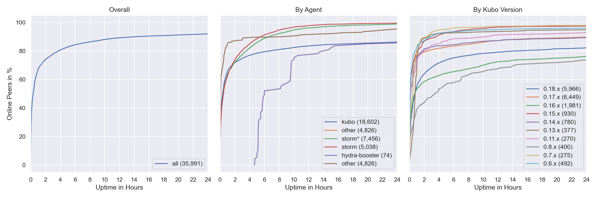

# IPFS Network Health


*Notes on what could appear on this page*

This is an interior detail page. Contains measurements related to the health and function of the network. Designed to answer questions such as: what is the request latency? what is the discovery success rate? how reliably and quickly does data propagate?

- Retrieval latency (via different resolution paths, each component in detail, current+historic)
- Churn, average lifetime of a peer
- Fragmentation/connectivity of network
- Distribution of content
- TODO…


## Churn

Only the top 10 kubo versions appear in the right graph (due to lack of colors) based on the average count in the time interval. The `0.8.x` versions **do not** contain disguised storm peers. This graph also excludes peers that were online the whole time. You can read this graph as: if I see a peer joining the network, what's the likelihood for it to stay `X` hours in the network.

`storm*` are `go-ipfs/0.8.0/48f94e2` peers that support at least one [storm specific protocol](#storm-specific-protocols).
