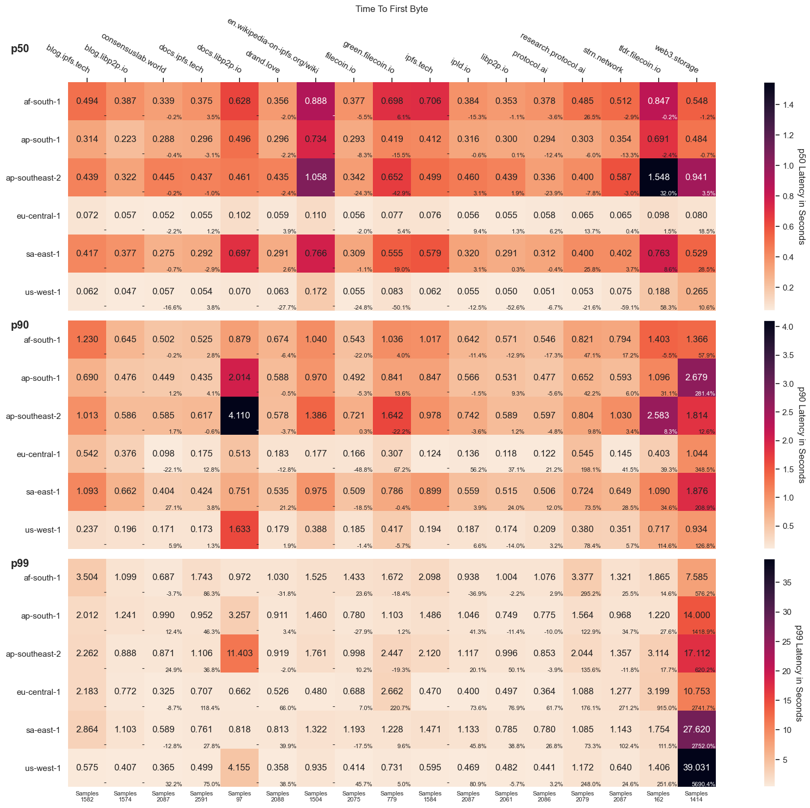
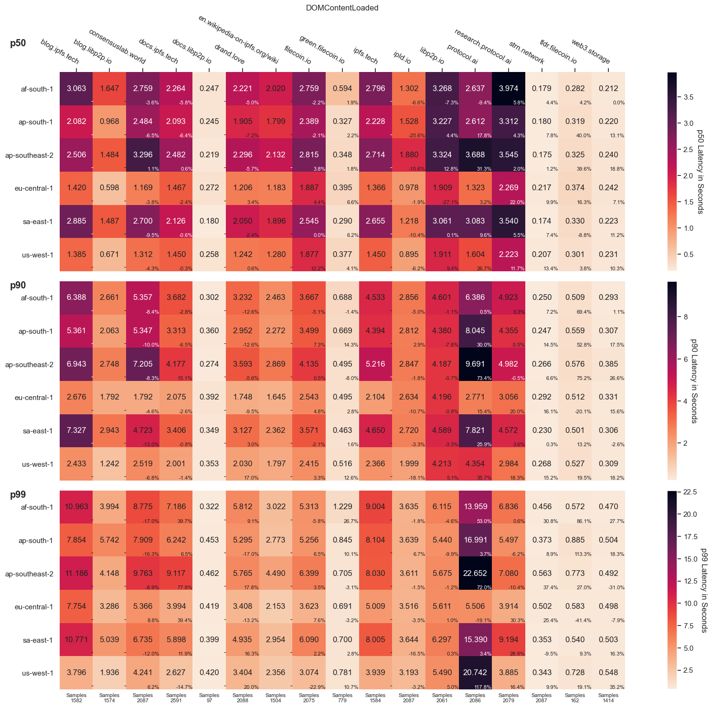

## Website Monitoring

We are using [`phantomas`](https://github.com/macbre/phantomas) for the following measurements. The graphs below show the p50, p90, and p99 timings of different metrics and aggregate the performance across the last week.

**Do you want another metric visualized?** Check out [this long list](https://github.com/macbre/phantomas/blob/devel/docs/metrics.md) of options.

### Time To First Byte

The time it took to receive the first byte of the first response (that was not a redirect). The large number in each tile is the time in seconds and the small number in each lower right corner is the percentage change compared to the previous week. The number at the very bottom of the graph shows the sample size that went into each subplot/website. Note: the color scales are different in each graph.

### DOMContentLoaded

The DOMContentLoaded event fires when the HTML document has been completely parsed, and all deferred scripts (`<script defer src="…">` and `<script type="module">`) have downloaded and executed. The large number in each tile is the time in seconds and the small number in each lower right corner is the percentage change compared to the previous week. The number at the very bottom of the graph shows the sample size that went into each subplot/website. Note: the color scales are different in each graph.

